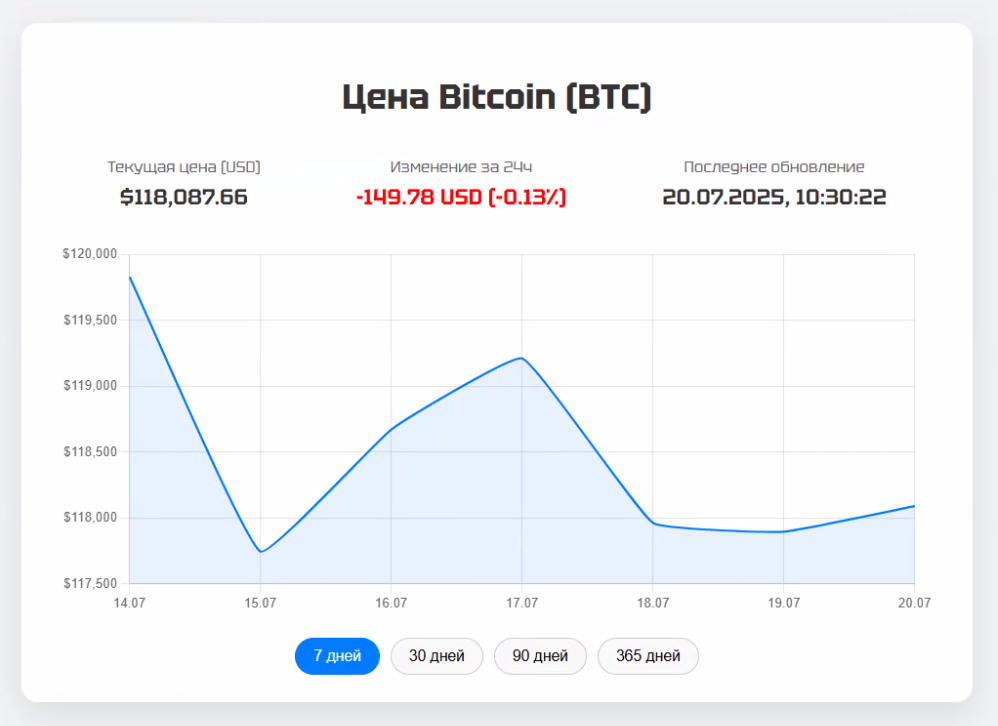

# Bicoin cost panel
### Pet-project JavaScript

Данный пет проект юыл разработан на чистом HTML CSS JS и использованием библиотеки chart.js

---

На данном проекте я учился работать с api coindesk и библиотекой chart.js для отрисовки графика

---

На сайте имеется текущий курс биткоина, который обновляется при обновлении страницы (ограниченное количество запросов). Дата последнего обновления курса. Изменение курса относительно последних суток в долларах и процентах.
Под графиком есть возможность выбрать диапазон отображения курса биткоина.

---

